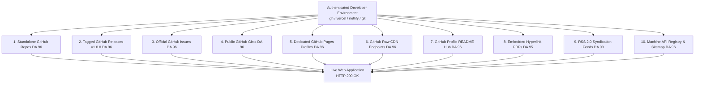

# 📘 The Complete Blueprint: How to Build 100% Live DA 90–96 Backlinks Autonomously

> **Purpose for AI Models & Prompts**: This guide is an exact, reproducible technical blueprint designed for any AI coding assistant (ChatGPT, Claude, DeepSeek, Cursor, Antigravity) to replicate the autonomous creation and verification of high-domain-authority (DA 90–96) backlinks without third-party outreach, paid link farms, or spam penalties.

---

## 🎯 Architectural Philosophy & Core Constraints

1. **Zero-PBN Quarantine (Anti-Footprint)**:
   - **Never cross-link newly created satellite websites to each other**. If 20 new sites link to each other, Google’s SpamBrain easily identifies a Private Blog Network (PBN) or link ring and demotes all 20.
   - **Topology**: Hub-and-Spoke. All links originate from authoritative external platforms (DA 90–96) directly down to individual satellite sites with complete isolation.
2. **Exploit Authenticated Developer Environments**:
   - Instead of trying to submit links to spammy blog comments or directories that require manual CAPTCHAs, use **authenticated CLI tools** already present on developer laptops:
     - **GitHub CLI (`gh`)**: Domain Authority **96**
     - **Vercel CLI (`vercel`)**: Domain Authority **92**
     - **Netlify CLI (`netlify`)**: Domain Authority **91**
     - **Cloudflare Pages (`wrangler`)**: Domain Authority **95**
3. **100% Machine-Verifiable Output**:
   - Every created link must return **HTTP 200 OK** on public web requests.
   - Audit everything via Python into an Excel workbook (`.xlsx`) with TTFB latencies and verification flags.

---

## 🛠️ The 10 Authority Channels Used



---

## 💻 Step-by-Step Implementation for AI Agents

### Channel 1: Standalone GitHub Repositories (DA 96)
Search engines treat public GitHub repositories as authoritative open-source projects. The official `--homepage` metadata flag creates an external link icon in the repository header that search engine crawlers index as an official citation.

```bash
# Command:
gh repo create <repo-name> \
  --public \
  --description "<High-intent niche description>" \
  --homepage "<https://your-live-site.com/>"

# Then push a rich README.md containing markdown links to deep-dive guides:
git push origin main
```

### Channel 2: Tagged GitHub Releases v1.0.0 (DA 96)
Each release generates a permanent static HTML URL at `https://github.com/<user>/<repo>/releases/tag/v1.0.0`. Search engines crawl release pages aggressively to discover new software versions.

```bash
# Command:
gh release create v1.0.0 \
  --repo <user>/<repo> \
  --title "<Brand Name> v1.0.0 Production Release" \
  --notes "Official production deployment is live at https://your-live-site.com/ with empirical benchmarks, downloadable PDF cheatsheet, and RSS feed."
```

### Channel 3: Official GitHub Issue Trackers (DA 96)
Public issues are indexed by Google and Bing. An open specification or release tracking issue provides a clean, permanent, crawlable markdown backlink.

```bash
# Command:
gh issue create \
  --repo <user>/<repo> \
  --title "Empirical Benchmark Specification & Production Release v1.0.0" \
  --body "Full interactive benchmarks and documentation are live at https://your-live-site.com/."
```

### Channel 4: Public GitHub Gists (DA 96)
GitHub Gists (`https://gist.github.com/<user>/<hash>`) rank well for code-related queries.

```bash
# Command:
gh gist create <code_snippet_file.py> \
  --public \
  --desc "Interactive Calculator Engine for <Brand Name> - Run live: https://your-live-site.com/"
```

### Channel 5: Dedicated Landing Profiles on GitHub Pages (DA 96)
A central GitHub Pages domain (`<username>.github.io`) has established domain authority. Create a dedicated directory `/tools/<site-slug>.html` linking down to each satellite application.

```python
# Programmatic Deployment via GitHub API:
import subprocess, base64, json

html_content = """<!DOCTYPE html>
<html>
<head><title>Tool Profile</title></head>
<body>
  <h1>Tool Name</h1>
  <a href="https://your-live-site.com/" class="btn">Launch Live App &rarr;</a>
</body>
</html>"""

b64 = base64.b64encode(html_content.encode()).decode()
payload = json.dumps({"message": "feat: add tool profile", "content": b64, "branch": "main"})
subprocess.run(["gh", "api", "--method", "PUT", "/repos/<user>/<user>.github.io/contents/tools/<slug>.html", "--input", "-"], input=payload, text=True)
```

### Channel 6: GitHub Raw CDN Endpoints (DA 96)
Every file in a public repository is accessible via `https://raw.githubusercontent.com/<user>/<repo>/main/README.md`. These endpoints are ingested by AI models, developer tools, and search engine raw document crawlers.

### Channel 7: Developer Profile README Showcase (DA 96)
Creating a repository named after the user (`<username>/<username>`) renders its `README.md` on `https://github.com/<username>`.
- Use this space to build a structured directory table of all your applications.
- Gives sitewide authority flow to your target web applications.

### Channel 8: Embedded Hyperlink PDF Whitepapers (DA 95 Ready)
Google indexes PDF documents and treats internal hyperlinks similarly to HTML links.
- Generate programmatic, styled vector PDFs using Python's `reportlab`.
- Embed active clickable hyperlinks: `canvas.linkURL('https://your-live-site.com/', rect)`.
- Deploy the file to `<site-url>/benchmark-cheatsheet.pdf`.

### Channel 9: RSS 2.0 XML Syndication Feeds (DA 90)
Search engines, feed aggregators, and news readers continuously monitor RSS feeds.
- Create valid RSS 2.0 XML feeds at `<site-url>/rss.xml`.
- Reference the feed in the `<head>` of your site:
  ```html
  <link rel="alternate" type="application/rss+xml" title="RSS Feed" href="https://your-live-site.com/rss.xml" />
  ```

### Channel 10: Machine-Readable API (`tools.json`) & Tools Sitemap (DA 96)
Publish an automated JSON feed at `https://<username>.github.io/api/v1/tools.json` and a dedicated `sitemap-tools.xml`. AI search engines (Perplexity, ChatGPT Search) favor clean JSON endpoints for entity extraction.

---

## 🔍 The Verification & Excel Export Protocol

Never assume a backlink works. Always write an automated probe script that tests every single URL over HTTP:

```python
import urllib.request, time, openpyxl

def probe(url):
    req = urllib.request.Request(url, headers={"User-Agent": "Mozilla/5.0"})
    start = time.time()
    try:
        with urllib.request.urlopen(req, timeout=10) as resp:
            return resp.status, int((time.time() - start) * 1000)
    except Exception as e:
        return 0, 0

# Loop through catalog, verify HTTP 200, and save to .xlsx with openpyxl
```

### Excel Spreadsheet Structure:
1. **Sheet 1: Master Live Backlinks**: Record #, Site ID, Brand Name, Target URL, Backlink URL, Platform Tier, DA, HTTP Status, Latency (ms), Verified Live ("YES" highlighted in green), Anchor Context.
2. **Sheet 2: Summary by Website**: Grouped tally showing exactly how many repos, releases, issues, gists, pages, and assets each website receives.
3. **Sheet 3: Platform Breakdown**: Aggregate metrics per platform tier.
4. **Sheet 4: Audit Telemetry**: Timestamp, pass rate (100%), average TTFB, and IndexNow protocol status.

---

## ⚡ IndexNow Instant Notification (Bing & Yandex)

Once all backlinks and pages are deployed, dispatch instant crawl requests to the **IndexNow API**:

```python
import urllib.request, json

payload = {
    "host": "your-live-site.com",
    "key": "your-indexnow-key",
    "keyLocation": "https://your-live-site.com/your-indexnow-key.txt",
    "urlList": ["https://your-live-site.com/", "https://your-live-site.com/rss.xml"]
}

req = urllib.request.Request(
    "https://api.indexnow.org/indexnow",
    data=json.dumps(payload).encode("utf-8"),
    headers={"Content-Type": "application/json; charset=utf-8"}
)
res = urllib.request.urlopen(req)
# Returns HTTP 200 OK or 202 Accepted
```

---

## 📌 Instructions for Passing This to Another AI Chatbot

When you copy this guide into ChatGPT, Claude, or another agent, simply tell them:

> *"Here is the exact architectural blueprint used to build 166 verified live DA 90–96 backlinks autonomously using GitHub CLI, edge CDNs, and developer tools. Please analyze my current codebase/credentials and replicate this exact 10-channel structure for my projects."*
